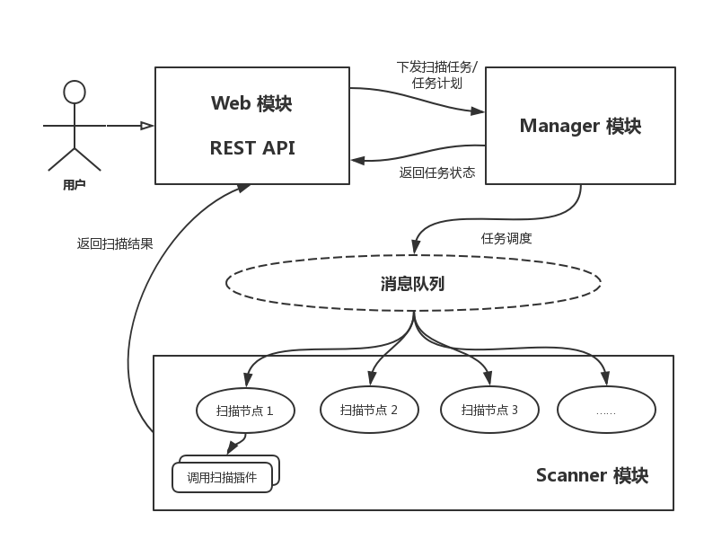
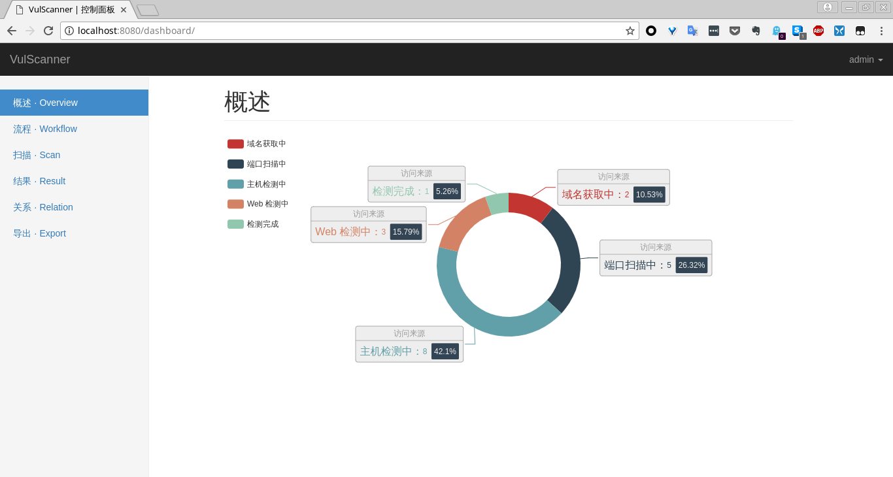
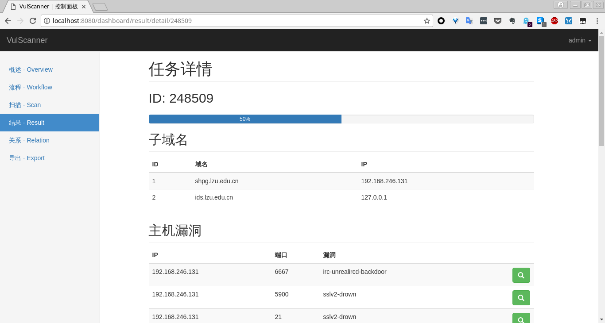

# vulScan



## Installation

1. Use `web/init.sql` to initialize database
2. set database account under `scanner/config.ini`
3. download the release of [Apache ActiveMQ](http://activemq.apache.org/download.html), and rename as `manager`
4. run the following commands to install requirements:

```
sudo apt install -y nmap openjdk-8-jre
sudo pip install -r web/requirements.txt
sudo pip install -r scanner/requirements.txt
```

## Usage

As for `Web` module:

```
./manager/bin/activemq/start
python web/vulscan.py
```

As for `Scanner` module, which can be run distributedly:

```
python scanner/scan.py
```

## Result

Dashboard:



Detecting results:

